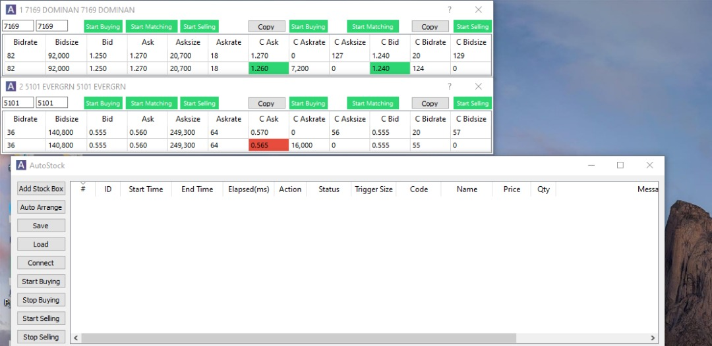

# AutoStock

A spread trading application for KLSE stocks, built with Qt/C++.

## Feature

- Auto trigger buy/sell.
- Able to control each pair individually.
- Real-time data collection from BursaStation.
